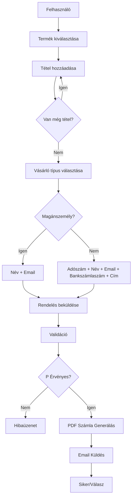

# Rendelési Űrlap Architektúra

## Áttekintés

Egy rendelési űrlap webalkalmazás, ahol a felhasználók termékeket rendelhetnek.

## Funkcionális Követelmények

### 1. Termék Kiválasztás
- Több termék kiválasztása egy listából
- Minden termékhez mennyiség megadása (fő)
- Dinamikus terméklista (bővíthető)

### 2. Vásárló Típusok
#### Magánszemély (magánszemély)
- Név (kötelező)
- Email cím (kötelező)

#### Vállalat (vállalat)
- Név (kötelező)
- Adószám (kötelező)
- Email cím (kötelező)
- Bankszámlaszám (kötelező)
- Cím (kötelező)

### 3. Űrlap Működés
- Váltó gomb a vásárló típusok között
- Több rendelési tétel hozzáadása/eltávolítása
- Valós időben számított összesen

### 4. Submit Művelet
- Űrlap validáció
- Email küldés PDF csatolmánnyal (számla)
- Siker/hibaválasz

## Technikai Stack

- **Frontend**: Next.js 16 + React 19 + TypeScript
- **Styling**: Tailwind CSS 4
- **PDF Generálás**: @react-pdf/renderer (terv)
- **Email**: Nodemailer (terv)

## Fájl Struktúra

```
app/
├── components/
│   └── OrderForm.tsx       # Fő rendelési űrlap komponens
├── types/
│   └── order.ts            # TypeScript típusok
├── data/
│   └── products.ts         # Termék adatok (placeholder)
├── api/
│   └── order/
│       └── route.ts         # Backend API endpoint
└── page.tsx                # Fő oldal (rendereli az űrlapot)
```

## API Endpoint

**POST /api/order**
- Bemenet: OrderRequest (termékek, vevő adatok)
- Kimenet: OrderResponse (siker/hiba, email státusz)

## Mermaid Diagram - Űrlap Folyamat



## Következő Lépések

1. **Types létrehozása** - TypeScript interfészek
2. **Termék adatok** - Placeholder terméklista
3. **OrderForm komponens** - Az űrlap UI
4. **API route** - Backend feldolgozás
5. **Email + PDF** - Részletek a felhasználótól
